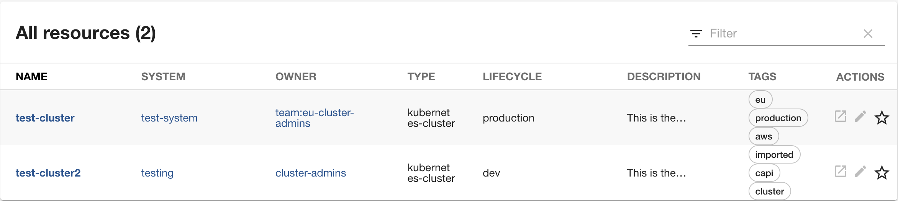

# Catalog Backend Module for Cluster API

This is an extension module to the plugin-catalog-backend plugin, with an entity provider to read CAPI clusters as Backstage Entities.



## Capabilities

This plugin has the following capabilities:

All CAPI clusters are discovered and imported into the Backstage catalog, as [Resource entities](https://backstage.io/docs/features/software-catalog/descriptor-format/#kind-resource) with `spec.type` set to `kubernetes-cluster`.

## For administrators

#### Prerequisites

You will need the [Backstage Kubernetes Plugin](https://backstage.io/docs/features/kubernetes/) installed and configured.

```yaml
kubernetes:
  serviceLocatorMethod:
    type: 'multiTenant'
  clusterLocatorMethods:
    - type: 'config'
      clusters:
        - name: production-cluster
          authProvider: 'serviceAccount'
          url: ${K8S_API_ENDPOINT}
          serviceAccountToken: ${K8S_ACCESS_TOKEN}
          caData: ${K8S_CA_DATA}
          skipTLSVerify: true
          skipMetricsLookup: true
```

### Installation

```console
yarn workspace backend add @bigkevmcd/catalog-backend-module-capi
```

You will need to import the Provider to `packages/backend/src/plugins/catalog.ts`

```typescript
import { CAPIClusterProvider } from '@bigkevmcd/catalog-backend-module-capi';

export default async function createPlugin(
  env: PluginEnvironment,
): Promise<Router> {
  const builder = await CatalogBuilder.create(env);

  const capiProvider = CAPIClusterProvider.fromConfig(env.config, {
    logger: env.logger,

    // You can configure the schedule either here, or individually within the providers
    // scheduler: env.scheduler,
    // OR
    // schedule: env.scheduler.createScheduledTaskRunner({
    //   frequency: { minutes: 30 },
    //   timeout: { minutes: 3 },
    // }),
  });
  builder.addEntityProvider(capiProvider);

  builder.addProcessor(new ScaffolderEntitiesProcessor());
  const { processingEngine, router } = await builder.build();
  await processingEngine.start();
  return router;
}
```

#### Configuration

Configure the Provider:

```yaml
catalog:
  providers:
    capi:
      hubClusterName: production-cluster # this name is looked up in the list of clusters
      # You can configure the scheduling centrally above, or via the individual providers like this
      schedule:
        frequency: { minutes: 5 }
        timeout: { minutes: 1 }
```

Alternatively, if you want to pull data from multiple clusters.

```yaml
catalog:
  providers:
    capi:
      eu-clusters:
        hubClusterName: eu-cluster
        defaultClusterOwner: group:eu-admins
      us-clusters:
        hubClusterName: us-cluster
        defaultClusterOwner: group:eu-admins
```

You can also provide defaults for fields in the Backstage entities:

```yaml
catalog:
  providers:
    capi:
      hubClusterName: production-cluster # this name is looked up in the list of clusters
      # You can configure the scheduling centrally above, or via the individual providers like this
      schedule:
        frequency: { minutes: 5 }
        timeout: { minutes: 1 }
      # All these fields are optional - annotations on the Cluster resources will override them
      defaults:
        clusterOwner: group:cluster-admins
        system: testing
        lifecycle: dev
        tags:
          - imported
          - capi
          - cluster
```

## Annotating CAPI resources

The provider supports annotations on your CAPI Clusters to help populate Backstage Entities:

```yaml
apiVersion: cluster.x-k8s.io/v1beta1
kind: Cluster
metadata:
  name: test-cluster
  namespace: default
  annotations:
    cluster.x-k8s.io/cluster-lifecycle: production
    cluster.x-k8s.io/cluster-owner: team:eu-cluster-admins
    cluster.x-k8s.io/cluster-description: This is the production cluster
    cluster.x-k8s.io/cluster-system: test-system
    cluster.x-k8s.io/cluster-tags: 'eu,production,aws'
spec:
  clusterNetwork:
    pods:
      cidrBlocks: ['192.168.0.0/16']
  infrastructureRef:
    kind: AWSManagedCluster
    apiVersion: infrastructure.cluster.x-k8s.io/v1beta2
    name: test-cluster
  controlPlaneRef:
    kind: AWSManagedControlPlane
    apiVersion: controlplane.cluster.x-k8s.io/v1beta2
    name: test-cluster-control-plane
```
